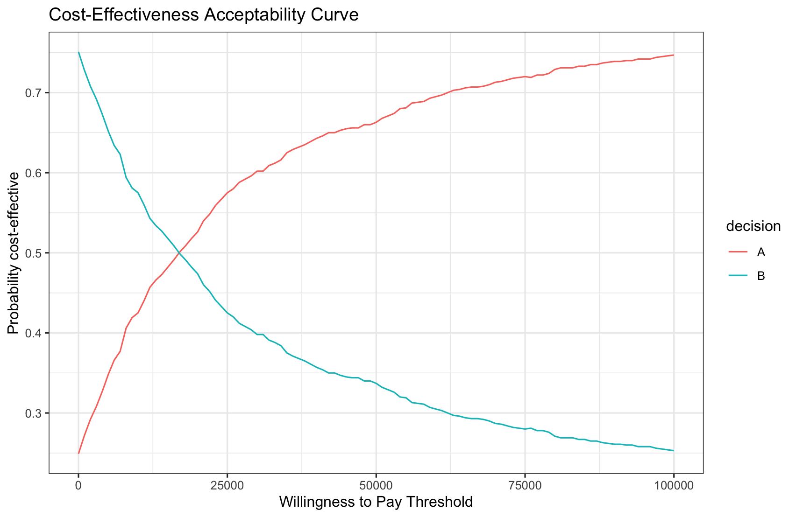

# `twig`


## Overview

**`twig`** is an R package designed to simplify decision and cost-effectiveness analyses. It introduces a Grammar of Modeling approach, inspired by the Grammar of Graphics in `ggplot2`, to streamline the creation, maintenance, and debugging of complex models. 

Key features include:

- Vectorized operations for efficient computation.
- Flexible modeling of decisions, states, events, and payoffs.
- Interactive syntax building via the [DecisionTwig](https://www.dashlab.ca/projects/decision_twig/) interface.

## Installation

Install `twig` from CRAN or GitHub:

```r
# Install from CRAN
install.packages("twig")

# Or install the latest development version from GitHub
library(devtools)
install_github("hjalal/twig")
```

## A Minimal Example

Below is a simple example of using `twig` to define a Markov model:

```r
library(twig)

# Define a basic Markov model using `twig`
mytwig <- twig() + 
  decisions(names = c("A", "B")) +               # Decision alternatives
  states(names = c("Alive", "Dead"),            # States and initial probabilities
         init_probs = c(1, 0)) + 
  event(name = "death_event",                   # Define an event (death)
        options = c("yes", "none"),             # Possible outcomes
        probs = c("pDie", "1 - pDie"),          # Probabilities
        transitions = c("Dead", "stay")) +      # Transitions
  payoffs(names = c("cost", "utility"))         # Define payoffs

# Print the model
print(mytwig)
```

This syntax minimizes repetition and allows you to model decisions, events, and payoffs efficiently. 

## DecisionTwig

In [DecisionTwig](https://www.dashlab.ca/projects/decision_twig/), this `twig` model can be built interactively:


DecisionTwig is a graphical user interface for building and debugging `twig` syntax, making it ideal for more complex models.

## Defining Functions

Next, we define the functions used in the `twig` model. These functions are vectorized for efficiency and can take core arguments (`decision`, `state`, `cycle`, `cycle_in_state`, and prior events):

```r
# 1. Probability of death depends on state and decision
pDie <- function(state, decision, rrMortA) {
  rDie <- 0.01 * # base mortality rate multiplied by 
    (state == "Alive") * # 1 if alive, 0 otherwise,  multiplied by 
    rrMortA^(decision == "A")  # relative risk of mortality for A only if decision is A, 1 otherwise
  rate2prob(rDie)  # Convert rate to probability
}

# 2. Cost depends on the decision
cost <- function(decision, cA, cB) {
  cA * (decision == "A") + # cost of A if decision is A 
  cB * (decision == "B") # cost of B if decision is B
}

# 3. Utility depends on the state
utility <- function(state, uAlive) {
  uAlive * # utility of alive multiplied by 
  (state == "Alive") # 1 if alive, 0 otherwise
}
```

This concise syntax avoids nesting multiple `ifelse` statements, making it easier to read and maintain.

## Defining Parameters

Create a probabilistic data frame for parameter sampling:

```r
n_sims <- 1000  # Number of simulations

psa_params <- data.frame(
  rrMortA = rnorm(n_sims, 0.9, 0.1),  # Relative risk of mortality
  cA = rlnorm(n_sims, 6, 1),          # Cost of A
  cB = rlnorm(n_sims, 5, 1),          # Cost of B
  uAlive = rbeta(n_sims, 0.8, 0.2)    # Utility of being alive
)

head(psa_params)  # Examine the first six samples
```

`twig` also accepts a list of scalar parameter values.

## Running the Model

Run the model for 50 cycles (e.g., years) and compute the average expected values for costs and utilities:

```r
results <- run_twig(twig_obj = mytwig, params = psa_params, n_cycles = 50)

results$mean_ev  # Average across simulations
#         payoff
# decision     cost  utility
#        A 32379.32 32.11033
#        B 12503.32 31.32062
```

Your results may vary slightly due to randomness in the parameter sampling.

## Incremental Cost-Effectiveness Ratio (ICER)

Calculate the ICER using the `calculate_icers` function:

```r
# calculate_icers(results$mean_ev)
#   decision     cost  utility inc_cost inc_utility     ICER status
# B        B 12503.32 31.32062       NA          NA       NA     ND
# A        A 32379.32 32.11033 19875.99   0.7897148 25168.57     ND
```
ND = Not dominated

## Cost-Effectiveness Acceptability Curve (CEAC)

Plot the CEAC using a range of willingness-to-pay (WTP) thresholds:

```r
plot_ceac(results$sim_ev, wtp_range = seq(0, 100000, by = 1000))
```



## Additional Resources

1. [Time-dependent Markov model](https://hjalal.github.io/twig/articles/markov_time_dep.html)
   - Transition probabilities dependent on decisions, states, time, tunnels, and prior events
   - Payoffs dependent on decisions, states, time, tunnels, prior events, and discounting

2. [Decision-tree](https://hjalal.github.io/twig/articles/decision_tree.html)
   - Building a decision tree for cost-effectiveness analysis
   - Handling multiple sequential events and dependent probabilities

## Disclaimer

Both **DecisionTwig** and **twig** are under active development and are provided as-is without warranty.

## License

This project is licensed under the GPL v3 International.

## Suggested Citations

- Jalal, H. (2024). Grammar of Modelling, twig R package. Retrieved from <https://github.com/hjalal/twig>
- Jalal, H. (2024). DecisionTwig. Retrieved from <https://www.dashlab.ca/projects/decision_twig/>
