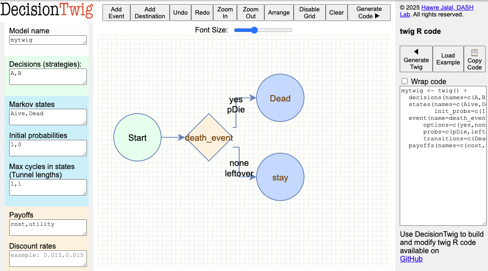

# `twig`

## Getting started

**twig** is an R package for building decision and cost-effectiveness analyses. Below we provide instructions to install the `twig` R package, a simple Markov model example, and reference two cost-effectivenss tutorials, one on a time-dependent Markov model and the other on a decision tree. For building `twig` syntax interactively, you can use [DecisionTwig](https://www.dashlab.ca/projects/decision_twig/) which is an online graphical user interface for developing `twig` syntax. 

## Installation

A CRAN version will soon be available. Meanwhile, to install **twig** from GitHub, use the following command in R:

```r
library(devtools)
install_github("hjalal/twig")
```

## Overview

`twig` streamlines the process of building models by defining a Grammar of Modeling inspired by the Grammar of Graphics used in the `ggplot2` package. `twig` leverages vectorized operations for efficiency.   

## A minimal example:

Consider this `twig` syntax:

``` r
mytwig <- twig() + 
  decisions(names = c("A", "B")) +  # Decision alternatives
  states(names = c("Alive", "Dead"),  # Markov state names
         init_probs = c(1, 0)) +  # The cohort starts healthy
  event(name = "death_event",  # A death event can have  
        options = c("yes", "none"),  # Two options: "yes" and "none"
        probs = c(pDie, leftover))  # Occur with probabilities pDie and leftover = 1 - pDie
  payoffs(names = c(cost, utility))  # will capture the cost and utility
```
The concept of Grammar of Modeling is insipred by `ggplot`'s Grammar of Graphics. The key benefit of adopting this grammar is to minimize repetition in decision and cost-effectiveness analysis modeling to streamline model building, maintenance and debugging.  The `twig` above consists of a `decisions` layer that includes the names of the alternative strategies or choices, a `states` layer that describes the Markov states and their initial probabilities, an `event` layer `die_event`, and finally a `payoffs` layer describing how rewards are accumulated.  

The key component of the Grammar of Modeling is to develop a *generic* sequence of events a `twig` that applies to the entire population.  The flow through these events can be controlled by the probability functions `probs` which can depend on the `decision`, `state`, `cycle`, `cycle_in_state` for tunnels and prior events in the `twig` 

## DecisionTwig 
In [DecisionTwig](https://www.dashlab.ca/projects/decision_twig/), this `twig` will look like this



DecisionTwig allows to interactively build the `twig` syntax. This can be especially helpful for more complex event sequence structure.  

## Vectorized functions
Next, we define the three functions that we used in the `twig`: `pDie`, `cost` and `utility`. Note that these functions are all vectorized, meaning that they can take a vector of states, decisions, and parameters and return a vector of probabilities, costs, and utilities. This is a key feature of `twig` that allows for efficient computation of the model across multiple simulations.

``` r
# 1. probability of death is a function of the state, decision and relative risk of mortality given treatment A
pDie <- function(state, decision, rrMortA){
  rDie <- 0.2*(state=="Alive") * rrMortA^(decision=="A") # rate of death is 20% if alive, 0 otherwise. This rate is multiplied by rrMortA for A, otherwise 1.
  rate2prob(rDie) # convert the rate into probability
}

# 2. cost is a function of the decision
cost <- function(decision, cA, cB){
  cA * (decision=="A") + 
  cB * (decision=="B")
}

# 3. utility is uAlive if alive, otherwise 0
utility <- function(state, uAlive){
  uAlive * (state=="Alive")
}
``` 

Here we use a concise way to define if statements.  For example, `cA * (decision=="A")` is equivalent to `ifelse(decision=="A", cA, 0)`. Both statements are vectorized and can take a vector of decisions and return a vector of costs. However, the former is more concise and easier to read because it avoids nesting multiple ifelse statements. 

We also used `rrMortA^(decision=="A")` to apply the relative risk of mortality if the decision is A, otherwise 1. This is because `decision=="A"` is treated as 1, and `decision!="A"` is treated as 0.  By combining `*` and `^` we can concisely express multiple conditional statements. 

## Parameters
Then, we can define our parameters as a probabilistic dataset of the parameters:

```r
n_sims <- 1000 # number of simulations

psa_params <- data.frame(
  rrMortA = rnorm(n_sims, 0.01, 0.001), # Normal: relative risk of mortality
  cA = rlnorm(n_sims, 10, 1), # Log-normal: cost of A
  cB = rlnorm(n_sims, 12, 1), # Log-normal: cost of B
  uAlive = rbeta(n_sims, 0.8, 0.2)) # Beta: utility of being alive

head(psa_params) # examining the first 6 samples

#       rrMortA        cA        cB    uAlive
# 1 0.009240403 36434.444 150835.86 0.1819717
# 2 0.012729583 24576.010  89905.15 0.6901971
# 3 0.010743772  7363.222 127403.07 0.1229560
# 4 0.009765270 14057.464 119454.46 0.9619981
# 5 0.010409442 34011.326  37668.27 0.9956655
# 6 0.009722109 18366.484 124804.39 0.9141599
``` 

Lastly, we run the model for 50 cycles (years):
``` r 
results <- run_twig(twig_obj = mytwig, params = psa_params, n_cycles = 50)

results$mean_ev #average across all simulations
#         reward
# decision      cost  utility
#        A 11943.623 4.666476
#        B  4407.286 3.658201
```

We can view the incremental cost-effectiveness ratio (ICER) 
``` r 
calculate_icers(results$mean_ev)
#   decision      cost  utility inc_cost inc_utility     ICER status
# B        B  4440.406 3.616307       NA          NA       NA     ND
# A        A 12139.424 3.826256 7699.017   0.2099492 36670.86     ND
```

and plot the cost-effectiveness acceptability curve (CEAC) using a range of willingness to pay (WTP) thresholds: 

``` r
plot_ceac(results$sim_ev, wtp_range = seq(0, 100000, by = 1000))
```


This brief tutorial demonstrated the basic functionality of the `twig` package with a simple Markov model. It shows how to define a simple `twig`, define the probabilistic input data, run the model, create the ICER table, and produce the CEAC curves. To illustrate more advanced functionality of `twig`, we provide two vignettes:

1. [Time-dependent Markov model](https://hjalal.github.io/twig/articles/markov_time_dep.html) using the sick-sicker model which illustrates the followign features:
- simulation time / age / cycle dependency 
- tunnel state / cycle in state / state residency dependency
- sequential events within each cycle
- transition rewards
- reward discounting

2. [Decision-tree](https://hjalal.github.io/twig/articles/decision_tree.html) illustrating the cost-effectiveness of herpes simplex encephalopathy
- decision tree
- multiple sequential events
- event dependency 
- payoff dependency on events

## Disclaimer

Please note that both **DecisionTwig** and **twig** are still under active development and are provided as-is without any warranty.

## License

This project is licensed under the GPL v3 International.

## Suggested citations:

Jalal, H. (2024). Grammar of Modelling, twig R package. Retrieved from <https://github.com/hjalal/twig>

Jalal, H. (2024). DecisionTwig. Retrieved from <https://www.dashlab.ca/projects/decision_twig/>
