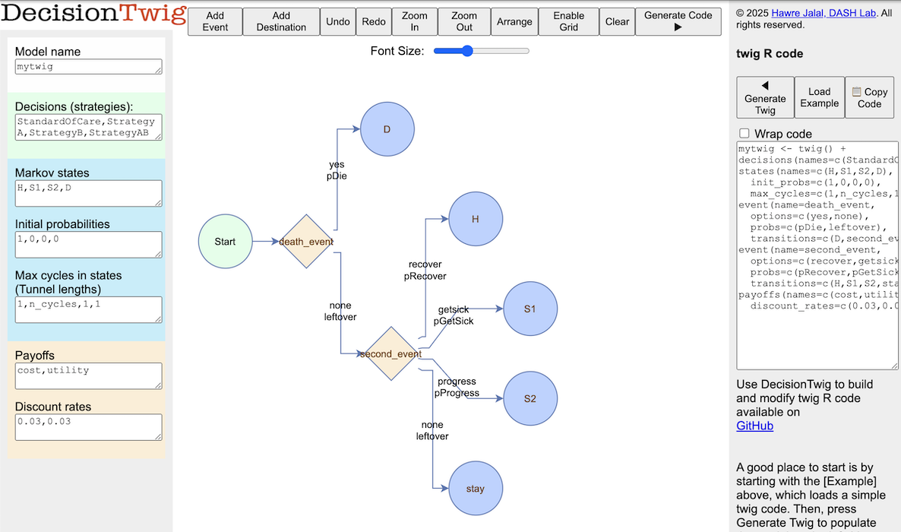

```{r, include = FALSE}
knitr::opts_chunk$set(
  collapse = TRUE,
  comment = "#>"
)
```

This vignette is based on our tutorial for time-dependent Markov models in R published in *Medical Decision Making*: 

*Alarid-Escudero, F., Krijkamp, E., Enns, E. A., Yang, A., Hunink, M. M., Pechlivanoglou, P., & Jalal, H. (2023). A tutorial on time-dependent cohort state-transition models in r using a cost-effectiveness analysis example. Medical Decision Making, 43(1), 21-41.*

First, we load `twig` library
```{r setup}
rm(list = ls())
options(width = 200) 
library(twig)
```

Then, we define the model's structure `twig`
```{r}
n_cycles <- 25 # number of cycles

mytwig <- twig() + 
  decisions(names = c(StandardOfCare, StrategyA, StrategyB, StrategyAB)) + # define decisions
  states(names = c(H, S1, S2, D), # Markov state names
         init_probs = c(1,0,0,0), # everyone starts at H
         max_cycles = c(1,n_cycles, 1, 1)) + # the cohort can stay in S1 for n_cycles
  event(name = death_event,  # first event is death
        options = c(yes,none), # which 2 options
        probs = c(pDie, leftover), # probability function name and its complement
        transitions = c(D, second_event)) + # if death occurs go to D, otherwise, go to the next event (second_event)
  event(name = second_event, # the second event
        options = c(recover, getsick, progress, none), # has 4 options
        probs = c(pRecover, pGetSick, pProgress, leftover), # and 3 named probabilities and a complement 
        transitions = c(H, S1, S2, stay)) + # resulting in transitions to H, S1, S2 or else staying in the original state
  payoffs(names = c(cost, utility), # payoff names
          discount_rates = c(0.03, 0.03)) # payoff discount rates

```

In [DecisionTwig](https://www.dashlab.ca/projects/decision_twig/), this Markov model looks like this:
{width=700px}

Next, we create a data frame of random samples from the model input parameters' distributions
``` {r}

n_sims <- 1000

# Create the data.table with n_sim rows of random samples
params <- data.frame(
  r_HS1         = rbeta(n_sims, 2, 10),             # Transition rate with beta distribution
  r_S1H         = rbeta(n_sims, 5, 5),              # Another transition rate with a different shape
  hr_S1         = rlnorm(n_sims, log(3), 0.2),      # Hazard ratio, log-normal to allow skewness
  hr_S2         = rlnorm(n_sims, log(10), 0.2),     # Higher hazard ratio, same distribution

  hr_S1S2_trtB  = rbeta(n_sims, 6, 4),              # Hazard ratio under treatment with beta distribution

  r_S1S2_scale  = rgamma(n_sims, shape = 2, rate = 25), # Scale parameter, gamma distribution
  r_S1S2_shape  = rgamma(n_sims, shape = 3, rate = 3),  # Shape parameter, gamma distribution

  c_H           = rnorm(n_sims, mean = 2000, sd = 50),   # Annual cost, slight variation for simulation
  c_S1          = rnorm(n_sims, mean = 4000, sd = 100),  # Higher annual cost, slightly varied
  c_S2          = rnorm(n_sims, mean = 15000, sd = 500), # Large cost with moderate variation
  c_D           = 0,                                        # Constant, no variation
  c_trtA        = rnorm(n_sims, mean = 12000, sd = 200), # Cost of treatment A with small variation
  c_trtB        = rnorm(n_sims, mean = 13000, sd = 200), # Cost of treatment B

  u_H           = rbeta(n_sims, 10, 1),                  # Utility close to 1 for Healthy
  u_S1          = rbeta(n_sims, 7.5, 2.5),               # Utility less than Healthy, beta distribution
  u_S2          = rbeta(n_sims, 5, 5),                   # Utility for Sicker
  u_D           = 0,                                        # Utility for Dead is constant
  u_trtA        = rbeta(n_sims, 9.5, 1),                 # Utility with treatment A, close to Healthy

  du_HS1        = rnorm(n_sims, mean = 0.01, sd = 0.005), # Disutility with slight variation
  ic_HS1        = rnorm(n_sims, mean = 1000, sd = 100),   # Cost increase with transition
  ic_D          = rnorm(n_sims, mean = 2000, sd = 100),    # Cost increase when dying
  p0_H          = rbeta(n_sims, 1, 9)                   # Initial probability of being Healthy
)

``` 


# Probability and Reward Functions
Then, we define the probability and reward functions used in the `twig` above:

### Probability of recovery
only those who are in S1 can recover

``` {r}
pRecover <- function(state, r_S1H){
  rRecover <- r_S1H * (state=="S1") 
  rate2prob(rRecover)
}
```

### Probability of getting sick
Only those who are H can get sick
``` {r}
pGetSick <- function(state, r_HS1){
  rGetSick <- r_HS1 * (state=="H")
  rate2prob(rGetSick)
}
```

###  probability of progressing
This depends on the state (only those who are in S1 can progress), the decision (different rates for different decisions), and the cycle_in_state (number of cycles spent in a state - tunnel state)
``` {r}
pProgress <- function(state, decision, cycle_in_state,
                      hr_S1S2_trtB, r_S1S2_scale, r_S1S2_shape){
  
  hr_S1S2 <- hr_S1S2_trtB ^ (decision %in% c("StrategyB", "StrategyAB")) # hazard rate of progression for B or 1 otherwise

  r_S1S2_tunnels <- ((cycle_in_state*r_S1S2_scale)^r_S1S2_shape - 
    ((cycle_in_state - 1)*r_S1S2_scale)^r_S1S2_shape) # hazard rate based on cycle_in_state (tunnel) which follows a weibull distribution

  # only those who are at S1 can progress
  rProgress <- r_S1S2_tunnels * (state=="S1") * hr_S1S2 

  rate2prob(rProgress)
}
```


###  probability of dying
Probabilty of dying depends on age. So, we first extract age-specific mortality data from a csv file. Then, we define the `pDie` as a function of the state (different states have different rates of death), and the cycles since the simulation start which reflects the cohort's age.
``` {r}
n_age_init <- 24 # starting age 
n_age_max  <- 100 # maximum age of simulation

# Age-dependent mortality rates 
lt_usa_2015 <- read.csv("../inst/extdata/LifeTable_USA_Mx_2015.csv")

# choose mortality rates from the 
v_r_mort_by_age <- as.matrix(lt_usa_2015$Total[lt_usa_2015$Age >= n_age_init & lt_usa_2015$Age < n_age_max])

# death depends on the state and age.
pDie <- function(state, cycle,
                 hr_S1, hr_S2){
  r_HD <- v_r_mort_by_age[cycle] # get age-specific mortality 
  rDie <- r_HD * (state=="H") +  # baseline mortality if healthy
          r_HD*hr_S1 * (state=="S1") +  # multiplied by a hazard rate if S1 or 
          r_HD*hr_S2 * (state=="S2") # S2
          # else 0
  rate2prob(rDie)
}
```

## Reward functions
### Cost
Cost is a function of the state, decision and whether either event have occured. The events capture transition costs. 
``` {r}
cost <- function(state, decision, second_event, death_event, 
                 ic_HS1, ic_D, c_trtA, c_trtB, 
                 c_H, c_S1, c_S2, c_D){
  # cost of decision is only applied if the state is either S1 or S2
  trans_cost_getting_sick <- ic_HS1 * (second_event=="getsick") # increase in cost when transitioning from Healthy to Sick
  trans_cost_dying <- ic_D * (death_event=="yes") # increase in cost when dying
  
  c_decision <- (state %in% c("S1","S2")) * (
      c_trtA * (decision=="StrategyA") +
      c_trtB * (decision=="StrategyB") +
      (c_trtA + c_trtB) * (decision=="StrategyAB") 
  )
  
  # cost of the state is a function of the state
  c_state <- c_H * (state=="H") + 
             c_S1 * (state=="S1") + 
             c_S2 * (state=="S2") + 
             c_D * (state=="D") 
  # combine both
  return(c_decision + c_state + trans_cost_getting_sick + trans_cost_dying)
}
```
### Utility
Similarly, utility depends on the state, decision and only if the cohort gotsick to apply a transition utility discount for those who make that transition.

``` {r}
utility <- function(state, decision, second_event,
                    du_HS1, u_H, u_trtA, u_S1, u_S2, u_D){

  trans_util_getting_sick <- -du_HS1 * (second_event=="getsick") # apply a utility discount for those who get sick.

  # calcualte state utilities. note that S1 will have utility u_trtA if the decision involves A, and another utility if the decision does not involve A.
  u_state <- u_H * (state=="H") + 
             u_trtA * (state=="S1" & decision %in% c("StrategyA", "StrategyAB")) +
             u_S1 * (state=="S1" & decision %out% c("StrategyA", "StrategyAB")) + 
             u_S2 * (state=="S2") + 
             u_D * (state=="D") 

  # combine the two utilities.
  return(u_state + trans_util_getting_sick)
}

```

# Running the `twig`
We can run the model and check the summary results under `results$Rewards_summary` of average costs and utilities across all probabilistic analyses.  The results also returns the individual simulation results under `results$Rewards_sim`

``` {r}
results <- run_twig(twig_obj = mytwig, params = params, n_cycles = n_cycles, verbose = FALSE, parallel = FALSE)

results$Rewards_summary
```


You can run the same command with parallelization, by setting `parallel = TRUE`. This will speed up the simulation by running each simulation in parallel. [It is commented out here because testing of the `twig` package only runs on a single core.]

``` {r}
# results <- run_twig(twig_obj = mytwig, params = params, n_cycles = n_cycles, parallel = TRUE)

```

## Incremental Cost-Effectiveness Ratio (ICER)
using the `calculate_icers` function adapted from the dampack package, we can retrieve ICER table by passing the rewards summary table.
``` {R}
calculate_icers(results$Rewards_summary)
```

## Cost-Effectiveness Acceptibility Curve (CEAC)
Similarly, we can produce the CEAC curve from the simulation results and specifying a series of willingness to pay (WTP) values.

```{r fig.width=7, fig.height=5}
plot_ceac(results$Rewards_sim, wtp_range = seq(0, 100000, by = 1000))
```
## Summary
This example illustrated the following features of `twig`
* Markov model
* probabilistic anslysis 
* Multiple decisions
* Multiple states
* Multiple sequential events
* tunnel states 
* cycle-dependency
* dependency on prior events in a cycle
* transition rewards
* using parallel computations
* expected rewards across probabilistic analyses
* ICER
* CEAC

In addition, various intermediate objects and computations can be returned by enabling `verbose`. To reduce the size of the returned results, this will only use the first PSA sample. For details on these objects check the documentations.

